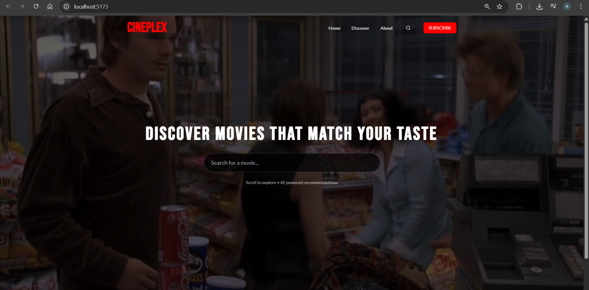
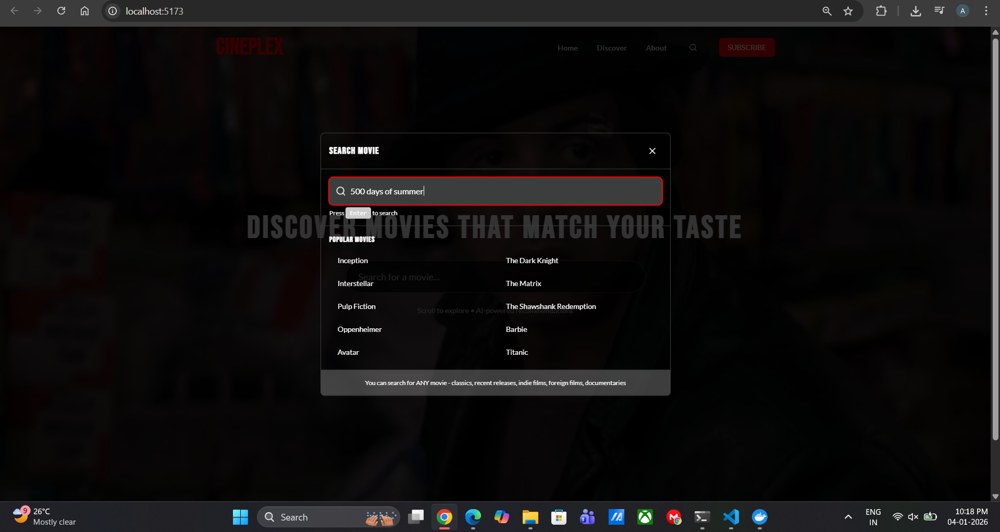
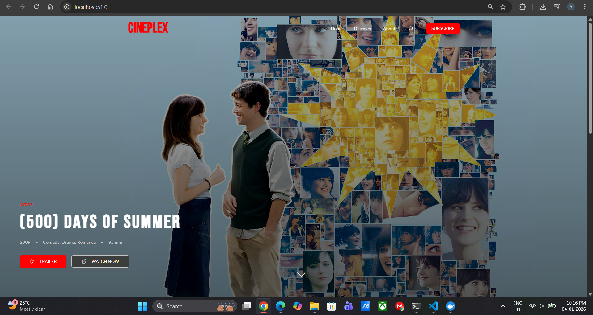
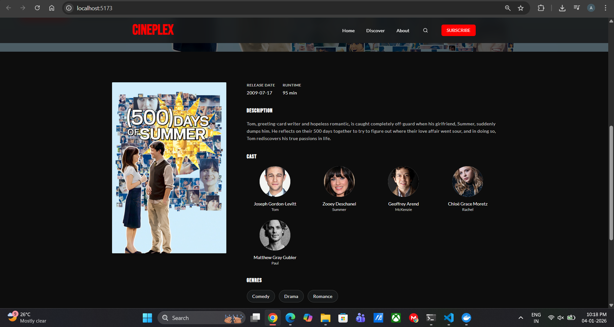
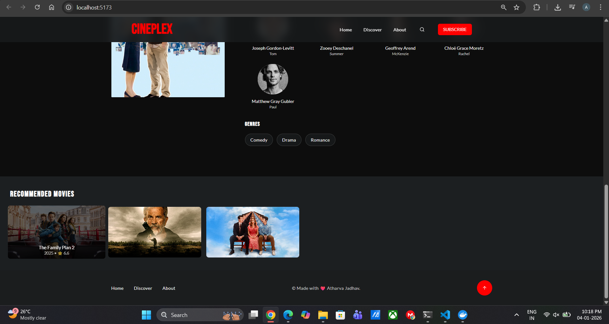

# 🎬 CinePlex

**AI-Powered Movie Discovery Platform with Semantic Recommendations**

Movie Insight is a modern web application that transforms movie discovery through artificial intelligence. Instead of traditional genre-based filtering, it uses Natural Language Processing to understand movie narratives and recommend films with similar stories, themes, and emotional tones.

---

## 🌟 Key Features

**Intelligent Search**  
Search any movie from TMDB's extensive database with real-time results and rich metadata.

**AI-Driven Recommendations**  
Advanced sentence embeddings analyze movie plots to suggest semantically similar films, going beyond simple genre matching.

**Cinematic Experience**  
Immersive UI with background video, smooth transitions, and a design inspired by premium streaming platforms.

**Comprehensive Movie Data**  
- Full plot summaries and overviews
- Cast and crew information
- Release dates and runtime
- Genre classifications
- High-quality backdrop images

**Interactive Discovery**  
Click any recommended movie to instantly explore it, creating an endless discovery loop.

---

## 🎯 Problem Statement

Traditional movie recommendation systems rely on:
- Genre tags (too broad)
- User ratings (popularity bias)
- Collaborative filtering (requires user history)

**Movie Insight solves this** by understanding the actual content and narrative of films, providing recommendations based on story similarity rather than superficial attributes.

---

## 🧠 Technical Architecture

### System Design

```
┌─────────────┐         ┌──────────────┐         ┌─────────────┐
│   React UI  │ ──────> │  Flask API   │ ──────> │  TMDB API   │
│  (Frontend) │ <────── │  (Backend)   │ <────── │  (Data)     │
└─────────────┘         └──────────────┘         └─────────────┘
                               │
                               │
                        ┌──────▼──────┐
                        │  Sentence   │
                        │ Transformer │
                        │   (AI/NLP)  │
                        └─────────────┘
```

### Technology Stack

**Frontend**
- **React 18** - Component-based UI framework
- **TypeScript** - Type-safe development
- **Vite** - Fast build tool and dev server
- **Tailwind CSS** - Utility-first styling

**Backend**
- **Flask** - Lightweight Python web framework
- **Sentence Transformers** - State-of-the-art NLP embeddings
- **scikit-learn** - Cosine similarity calculations
- **TMDB API** - Movie database and metadata

**AI/ML Pipeline**
- **all-MiniLM-L6-v2** - Efficient sentence embedding model
- **Vector Similarity Search** - Fast recommendation matching
- **Cached Embeddings** - Performance optimization

---

## 🚀 Getting Started

### Prerequisites

Ensure you have the following installed:
- **Node.js** 18.x or higher
- **Python** 3.9 or higher
- **npm** or **yarn**
- **TMDB API Key** ([Get one here](https://www.themoviedb.org/settings/api))

### Installation

#### 1. Clone the Repository

```bash
git clone https://github.com/atharva723/movie_insight_using_react_flask.git
cd movie-insight
```

#### 2. Backend Setup

```bash
cd backend

# Create virtual environment
python -m venv venv

# Activate virtual environment
# On Windows:
venv\Scripts\activate
# On macOS/Linux:
source venv/bin/activate

# Install dependencies
pip install -r requirements.txt
```

Create a `.env` file in the `backend` directory:

```env
TMDB_API_KEY=your_api_key_here
FLASK_ENV=development
```

Or update `app.py` directly:

```python
TMDB_API_KEY = "your_api_key_here"
```

Start the backend server:

```bash
python app.py
```

Backend will run at: `http://localhost:5000`

#### 3. Frontend Setup

```bash
cd ../frontend

# Install dependencies
npm install

# Start development server
npm run dev
```

Frontend will run at: `http://localhost:5173`

#### 4. Background Video (Optional)

Place your background video at:
```
frontend/public/videos/hero-video.mp4
```

**Video Requirements:**
- Format: MP4
- Codec: H.264 video + AAC audio
- Recommended: 1920x1080 or higher
- Keep file size under 10MB for performance

---

## 📁 Project Structure

```
movie-insight/
│
├── backend/
│   ├── app.py                    # Flask API server
│   ├── requirements.txt          # Python dependencies
│   ├── .env                      # Environment variables
│   └── venv/                     # Virtual environment
│
├── frontend/
│   ├── public/
│   │   └── videos/
│   │       └── hero-video.mp4         # Background video
│   │
│   ├── src/
│   │   ├── components/
│   │   │   ├── LandingHero.tsx          # Landing page hero
│   │   │   ├── HeroMovieHighlight.tsx   # Movie backdrop section
│   │   │   ├── MovieInfoPanel.tsx       # Movie details panel
│   │   │   ├── RecommendedMovies.tsx    # Recommendations grid
│   │   │   ├── SimpleSearchModal.tsx    # Search modal
│   │   │   └── FooterToolbar.tsx        # Footer navigation
│   │   │
│   │   ├── services/
│   │   │   └── movieApi.ts              # API service layer
│   │   │
│   │   ├── App.tsx                      # Main app component
│   │   ├── main.tsx                     # Entry point
│   │   └── index.css                    # Global styles
│   │
│   ├── index.html
│   ├── vite.config.ts
│   ├── tsconfig.json
│   ├── tailwind.config.js
│   └── package.json
│
└── README.md
```

---

## 🔬 How It Works

### 1. Movie Search Flow

```
User Input → Frontend → Flask API → TMDB API → Movie Data
```

User enters a movie title, frontend sends request to Flask, which queries TMDB for matching results.

### 2. AI Recommendation Engine

```
Movie Plot → Sentence Embedding → Vector Space → Cosine Similarity → Top Matches
```

**Process:**
1. Extract movie overview/plot text
2. Convert to 384-dimensional vector using Sentence Transformers
3. Compare with pre-cached movie embeddings
4. Calculate cosine similarity scores
5. Return top 12 most similar movies

**Why This Works:**
- Semantic understanding captures narrative themes
- Goes beyond keyword matching
- Understands context and story structure
- Finds films with similar emotional tones

### 3. Caching Strategy

Popular movies are pre-embedded and cached to avoid repeated API calls and improve response time.

---

## 🎨 UI/UX Highlights

- **Video Background**: Cinematic feel with ambient video
- **Smooth Transitions**: Fade effects between states
- **Responsive Design**: Works on desktop, tablet, and mobile
- **Loading States**: Skeleton loaders and progress indicators
- **Error Handling**: Graceful fallbacks for failed requests
- **Accessibility**: Semantic HTML and ARIA labels

---

## 📊 API Endpoints

### Search Movie
```
GET /api/search?query={movie_name}
```

**Response:**
```json
{
  "results": [
    {
      "id": 550,
      "title": "Fight Club",
      "overview": "A ticking-time-bomb...",
      "poster_path": "/path/to/poster.jpg",
      "backdrop_path": "/path/to/backdrop.jpg",
      "vote_average": 8.4,
      "release_date": "1999-10-15"
    }
  ]
}
```

### Get Recommendations
```
GET /api/recommend?movie_id={tmdb_id}
```

**Response:**
```json
{
  "movie": {
    "id": 550,
    "title": "Fight Club",
    "overview": "...",
    "genres": ["Drama", "Thriller"],
    "cast": [...],
    "runtime": 139
  },
  "recommendations": [...]
}
```

---

## 🔮 Future Enhancements

**Phase 1 - Core Features**
- [ ] User authentication and profiles
- [ ] Watchlist and favorites
- [ ] Movie ratings and reviews
- [ ] Advanced filters (year, rating, runtime)

**Phase 2 - AI Improvements**
- [ ] Hybrid recommendation (collaborative + content-based)
- [ ] Personalized recommendations based on viewing history
- [ ] Multi-lingual support
- [ ] Mood-based recommendations

**Phase 3 - Platform Features**
- [ ] Trailer playback (YouTube embed)
- [ ] Social features (share, discuss)
- [ ] Movie comparison tool
- [ ] Streaming availability checker

**Phase 4 - Deployment**
- [ ] Cloud hosting (Vercel + Render/Railway)
- [ ] CI/CD pipeline
- [ ] Performance monitoring
- [ ] Analytics dashboard

---
# 🐳 Docker Deployment

The application is fully containerized and available as Docker images for easy deployment.

---
## 🐳 Docker Hub

- 🔧 **Backend Image**: [atharvar24/movieinsight-backend](https://hub.docker.com/r/atharvar24/movieinsight-backend)
- 🎨 **Frontend Image**: [atharvar24/movieinsight-frontend](https://hub.docker.com/r/atharvar24/movieinsight-frontend)

---

### Backend Issues

**Model download timeout:**
```bash
# Pre-download model in Dockerfile
RUN python -c "from sentence_transformers import SentenceTransformer; SentenceTransformer('sentence-transformers/all-MiniLM-L6-v2')"
```

**Port already in use:**
```bash
# Use different port
docker run -p 5001:5000 atharva723/cineplex-backend:latest
```

### Frontend Issues

**API connection refused:**
- Update backend URL in frontend build
- Check if both containers are on same network
- Verify backend is running

**Video not playing:**
```bash
# Mount videos directory
docker run -v /path/to/videos:/usr/share/nginx/html/videos atharva723/cineplex-frontend:latest
```

---

## 📈 Performance Optimization

### Multi-stage Builds

Both Dockerfiles use multi-stage builds to reduce image size:

- **Backend:** ~800MB (includes AI model)
- **Frontend:** ~25MB (optimized nginx + built assets)


## 🐛 Troubleshooting

**Backend won't start:**
```bash
# Make sure virtual environment is activated
source venv/bin/activate  # or venv\Scripts\activate on Windows

# Reinstall dependencies
pip install --upgrade -r requirements.txt
```

**Frontend shows CORS errors:**
```python
# Ensure Flask has CORS enabled in app.py
from flask_cors import CORS
CORS(app)
```

**Video won't play:**
- Check video codec (must be H.264)
- Verify file path in `public/videos/`
- Check browser console for errors

**Slow recommendations:**
- First request downloads the AI model (~90MB)
- Subsequent requests use cached embeddings
- Consider pre-warming cache on server start

---

## 🤝 Contributing

Contributions are welcome! Please feel free to submit a Pull Request.

1. Fork the repository
2. Create your feature branch (`git checkout -b feature/AmazingFeature`)
3. Commit your changes (`git commit -m 'Add some AmazingFeature'`)
4. Push to the branch (`git push origin feature/AmazingFeature`)
5. Open a Pull Request

---

## 📝 License

This project is developed for educational and portfolio purposes.

**Third-party Services:**
- TMDB data is used under [TMDB API Terms](https://www.themoviedb.org/documentation/api/terms-of-use)
- Sentence Transformers is licensed under [Apache 2.0](https://www.apache.org/licenses/LICENSE-2.0)

---

## 👨‍💻 Author

**Atharva Jadhav**  
Full-Stack Developer & AI Enthusiast

- GitHub: [@yourhandle](https://github.com/atharva723)
- LinkedIn: [Your Profile](https://www.linkedin.com/in/atharva-jadhav-b122102b3/)


---

## 🙏 Acknowledgments

- [TMDB](https://www.themoviedb.org/) for comprehensive movie data
- [Sentence Transformers](https://www.sbert.net/) for powerful NLP models
- [React](https://react.dev/) and [Flask](https://flask.palletsprojects.com/) communities

---

## 📸 Screenshots

> Add your screenshots here once deployed!

### Landing Page


### Movie Details




### Recommendations


---

**Built with ❤️ using React, Flask, and AI**
